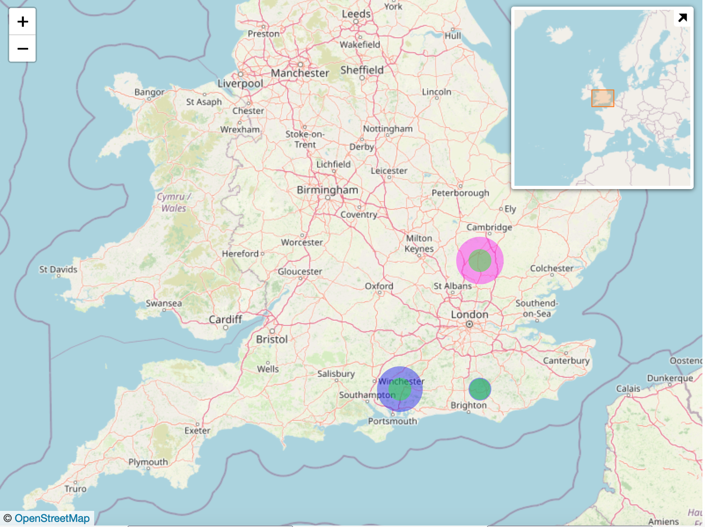

# Geo Visualizations

Interactive visualizations over a map or other tiled imagery such as an Geo Visualisation

## Table of Contents

* [Purpose](#purpose)
* [Geo Visualisation](#geo-visualisation)
  * [Data Summary](#geo-visualisation-data-summary)
  * [Style](#geo-visualisation-style)
  * [Inputs](#geo-visualisation-inputs)
  * [Outputs](#geo-visualisation-outputs)
  * [Actions](#geo-visualisation-actions)
  * [Data Details](#geo-visualisation-data-details)
  * [Visualization Content Security Policy](#geo-visualisation-visualization-content-security-policy)

## Purpose

The package contains two visualizations sharing common features of overlays on top of imagery that can be panned and zoomed.

* __Geo Visualisation__ visualization provides free flowing interaction with a multi-layered picture of an organisation offering rapid information discovery
* __Google Maps__ visualization provides interaction with MooD data driven overlays on a Google Map

### Geo Visualisation Purpose

The visualization allows the user to interact with a multi-layered map over which are drawn markers to visually convey location based information. The user can hover the cursor over areas of interest and instantly see information from the MooD repository. The user can click on a feature to navigate to a detailed view of the information at the location.

The visualization connects to a Tile Server to receive the images to display as the user pans and zooms. An edit mode allows solution designers to move, resize and reshape the markers overlaying the tile images. See [Content Security Policy](#geo-visualisation-visualization-content-security-policy) for details of granting permission to access the tile server from MooD.

[Table of Contents](#table-of-contents)

## Geo Visualisation

### Geo Visualisation Data Summary

The Geo Visualisation visualization consumes five data sets. The details of the attributes of the data set is provided in the section Data Details section

1. __Markers__
    * Details of the point markers to draw over the map

[Table of Contents](#table-of-contents)

### Geo Visualisation Style

The style of the visualisation is controlled by CSS and a collection of properties.

#### CSS

A Cascading Style Sheet (CSS) is defined containing selectors for the HTML elements created by __leaflet__, the third party component that renders the map. The CSS is editable within MooD BA, allowing control of the visual styling of the diagram.

[Table of Contents](#table-of-contents)

#### Properties (JSON)

The properties are:

* __background__: defines the background colour of the container for the map. Supports setting as solid color using rgb(255,255,255), rgba(255,255,255,1), #fff. __Default rgba(255, 255, 255, 1)__
* __numLayers__: The number of layers of features, a value between 1 and 10. This can be fewer than the number of zoom levels of the map imagery. See the __endZoom__ property in the __layers__ array for an explanation of the mapping of feature layers to map zoom levels.
* __layers__: An array defining the styling applied to each of the feature layers
  * __featureBorderOpacity__: The opacity of the border for markers / overlays (0 - 1). __Default 0.5__
  * __featureBorderColour__: The default colour for the border for markers / overlays. This can be overridden by the data for individual features. __Default #D0D0D0__
  * __featureWeight__: The thickness of the border for markers / overlays in pixels.  __Default 0__
  * __featureOpacity__: The opacity of the feature markers / overlays (0 - 1). __Default 0.2__
  * __featureHighlightOpacity__: The opacity of the feature markers / overlays when the cursor is hovering over (0 - 1). __Default 0.5__
  * __featureColour__: The default colour for markers / overlays. This can be overridden by the data for individual features. __Default #D0D0D0__
  * __displayFeatureName__: Indicates if the name of features should be displayed on the map. This can be overridden by the data for individual features. __Default true__
  * __startZoom__: the minimum zoom level of the map that features in the layer are visible at.
  * __endZoom__: the maximum zoom level of the map that features in the layer are visible at.
* __zoomControl__: Indicates if the Zoom Control (+ and - buttons) should be enabled. __Default true__
* __controlPosition__: A string specifying where the Zoom Control, and edit controls when in edit mode, is displayed, e.g. 'topleft', 'bottomright'. __Default topleft__
* __attribution__: Text to display on the map to provide the necessary attribution when the map imagery is copyright.
* __attributionPosition__: The position to place the attribution text. __Default bottomleft__
* __miniMapControl__: Indicates if the Mini Map Control should be enabled. The Mini Map Control provides a smaller, zoomed out version of the map imagery to assist with navigating detailed maps. __Default true__
* __miniMapPosition__: The position to place the attribution text. __Default bottomright__
* __miniMapMinimized__: Indicates if the Mini Map Control should be displayed minimized (true) or maximized (false) when the map is initially drawn. __Default true__
* __miniMapWidth__: The width in pixels of the Mini Map Control when maximized. __Default 200__
* __miniMapHeight__: The height in pixels of the Mini Map Control when maximized. __Default 200__
* __miniMapZoomOffset__: The amount in zoom levels that the Mini Map Control should zoom out (negative number) or zoom in (positive number) from the level that the main map is at. __Default -5__
* __limitMarkersToCount__: The maximum number of node markers to display in edit mode. This avoids clutter when nearby shapes have lots of nodes. When __limitMarkersToCount__ is undefined, no limit is applied __Default 20__

[Table of Contents](#table-of-contents)

### Geo Visualisation Inputs

The visualization has fifteen inputs.

* __Tile Server URL__: The URL of the tile server that delivers map tiles. A string of the following form: _https://{s}.somedomain.com/blabla/_. {s} means one of the available subdomains (used sequentially to help with browser parallel requests per domain limitation; subdomain values are specified in __tileServerSubDomains__, can be omitted). __Note:__ You need to ensure the content security policy for the repository permits access to the tile server; see [Visualization Content Security Policy](#geo-visualisation-visualization-content-security-policy) for how to do this.
* __Tile Server Sub-domains__: A comma separated string of sub-domain names for the tile server. Some image map servers provide multi-domain or sub-domain structures in order to optimize data downloading. In order to use sub-domains, the __Tile Server__ URL must include {s} place holder. The array should be empty for a tile server without sub-domains. __Default: empty string__
* __Tile Pattern__: Defines the tile pattern for the tile server. A string of the following form: _{z}/{x}/{y}{r}.png_. {z} — zoom level, {x} and {y} — tile coordinates. {r} can be used to add "@2x" to the URL to load retina tiles.
* __Tile Width__: Defines the width of the tiles that the tile server delivers. __Default 256__
* __Tile Height__: Defines the height of the tiles that the tile server delivers. __Default 256__
* __Coordinate Reference System__: The Coordinate Reference System (CRS) for projecting geographical points into pixel (screen) coordinates. For geographical map tiles, there is a choice of projections. For maps of flat surfaces such as game maps or rich pictures there is a simple CRS to use instead. The options are:
  * __simple__: use for tiles representing flat surfaces such as game maps or rich pictures.
  * __spherical__: use for tiles representing maps with a Spherical Mercator Projection. This is the most common for online maps such as Open Street Map and Google Map. This corresponds to _EPSG:3857_ within the European Petroleum Survey Group (EPSG) registry of geodetic datums, spatial reference systems, Earth ellipsoids, coordinate transformations and related units of measurement. __This is the default option__.
  * __equirectangular__:  coordinate system based on the Earth's center of mass, used by the Global Positioning System among others. This corresponds to _EPSG:4326_.
  * __elliptical__: Elliptical Mercator Projection, corresponding to _ESPG:3395_. Excludes polar regions; maps the world between 80 degrees South and 84 degrees North.
* __Bounds - Bottom Left X Coordinate__: Bottom left X coordinate bounding the area into which map tiles will be loaded. __Default -180__
* __Bounds - Bottom Left Y Coordinate__: Bottom left Y coordinate bounding the area into which map tiles will be loaded. __Default -90__
* __Bounds - Top Right X Coordinate__: Top right X coordinate bounding the area into which map tiles will be loaded. __Default 180__
* __Bounds - Top Right Y Coordinate__: Top right Y coordinate bounding the area into which map tiles will be loaded. __Default 90__
* __Zoom Min__: The minimum zoom level to display the map at
* __Zoom Max__: The maximum zoom level to display the map at
* __Zoom Level__: The zoom level to draw the map at. __Default 1__
* __Centre X Coord / Longitude__: X coordinate or Longitude of the location to centre the Map. __Default 0__
* __Centre Y Coord / Latitude__: Y coordinate or Latitude of the location to centre the Map. __Default 0__

[Table of Contents](#table-of-contents)

### Geo Visualisation Outputs

The visualization has one output.

* __Feature__: the identity of the feature that the cursor is hovering over

[Table of Contents](#table-of-contents)

### Geo Visualisation Actions

The visualization has one event. This can be configured to trigger actions in MooD, e.g. navigation

1. __Feature Click__: a mouse click on a feature
    * Identifies the element

[Table of Contents](#table-of-contents)

### Geo Visualisation Data Details

1. __Markers__ – zero or more point feature elements to display
    * __Name__: the name of the feature.
	* __Longitude of marker__: the Longitude of the position of the marker
	* __Latitude of marker__: the Latitude of the position of the marker
    * __Minimum Layer point displayed at__: The minimum 1 based layer index for the overlay layer that the point is displayed at. If undefined this defaults to 1.
    * __Maximum Layer point displayed at__: The maximum 1 based layer index for the overlay layer that the point is displayed at. If undefined then if the minimum layer is also undefined this defaults to the maximum layer, i.e. all layers. If undefined and the minimum layer is defined then this defaults to the minimum layer, i.e. the one layer.
    * __Size of marker in metres__: The radius of the circle drawn for the marker.
	* __Colour of outer marker__: The colour of the outer circle drawn for the marker.
	* __Colour of border on outer marker__: The colour of the border of outer circle drawn for the marker.
	* __Border width on outer marker__: The width of the border, in pixels, for the outer circle
	* __Value represented by outer marker__: The value represented by the outer circle, e.g. the total capacity of a storage tank
	* __Colour of inner marker__: The colour of the inner circle drawn for the marker.
	* __Colour of border on inner marker__: The colour of the border of inner circle drawn for the marker.
	* __Border width on inner marker__: The width of the border, in pixels, for the inner circle
	* __Value represented by inner marker__: The value represented by the inner circle, e.g. the volume currently stored in the tank. The radius of the inner circle is in proportion to the inner value / outer value
	* __Display Name__: Indicates if the name of the feature should appear as a tooltip (true) or not (false) when hovering the cursor over the feature. If undefined, the configuration for the layer is used instead.

[Table of Contents](#table-of-contents)

### Geo Visualisation Visualization Content Security Policy

The default security policy for a MooD repository does not allow Custom Visualizations in MooD Active Enterprise (MAE) to access external domains. In order for this custom visualization to access a tile server in an external domain the Visualization Content Security Policy (CSP) needs to be relaxed by following the instructions below. __Repository Administration__ permissions are required for this.

1. __Create a backup of the repository.__ The CSP requires a precise syntax, so having a backup will allow you to recover from mistakes
1. In MooD Business Architect select the _Manage Repository_ option in the _File_ menu
1. Select the _Active Enterprise Settings..._ option
1. Select the _Security_ tab
1. Select the content of the _Visualization Content Security Policy_ field and copy to the clipboard. Be careful to select the content of the _Visualization Content Security Policy_ field not the _Content Security Policy_ field
1. Open a text editor and paste the CSP text into it
1. Find the _img-src_ section of the CSP. The default _img-src_ setting is `img-src 'self' data: blob:;`
1. Insert the domain of the tile server into the _img-src_ setting after `'self'`, e.g. `img-src 'self' *.somedomain.com data: blob:;`
1. Select the entire CSP string in the text editor and copy to the clipboard
1. You can check the format of any Content Security Policy which you create using an online validator such as <https://cspvalidator.org/>
1. Select the content of the _Visualization Content Security Policy_ field and paste the CSP string to replace it with your updated CSP
1. Click the _OK_ button on the _Active Enterprise Settings..._ dialogue to apply the changes

[Table of Contents](#table-of-contents)
