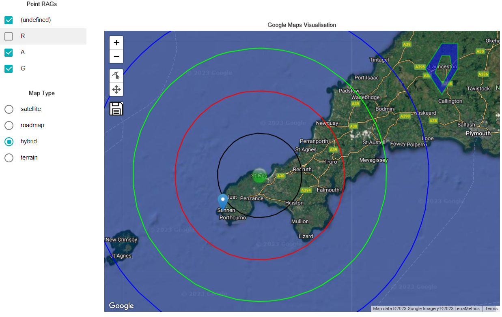

# Map Visualizations

Interactive visualizations over a map or other tiled imagery such as an operating model

## Table of Contents

* [Purpose](#purpose)
* [Operating Model](#operating-model)
  * [Data Summary](#op-model-data-summary)
  * [Style](#op-model-style)
  * [Inputs](#op-model-inputs)
  * [Outputs](#op-model-outputs)
  * [Actions](#op-model-actions)
  * [Data Details](#op-model-data-details)
  * [Visualization Content Security Policy](#op-model-visualization-content-security-policy)
* [Google Maps](#google-maps)
  * [Data Summary](#google-maps-data-summary)
  * [Style](#google-maps-style)
  * [Inputs](#google-maps-inputs)
  * [Outputs](#google-maps-outputs)
  * [Actions](#google-maps-actions)
  * [Data Details](#google-maps-data-details)
  * [Visualization Content Security Policy](#google-maps-visualization-content-security-policy)
* [Tools](#tools)
  * [Visual Studio Code with "XML to JSON" extension installed](#visual-studio-code-with-xml-to-json-extension-installed)

## Purpose

The package contains two visualizations sharing common features of overlays on top of imagery that can be panned and zoomed.

* __Operating Model__ visualization provides free flowing interaction with a multi-layered picture of an organisation offering rapid information discovery
* __Google Maps__ visualization provides interaction with MooD data driven overlays on a Google Map

### Operating Model Purpose

The visualization presents a multi-layered map of an organisation which the user can pan around and zoom in and out. Areas of the map can be marked, visibly or invisibly, allowing the user to hover the cursor over areas of interest and instantly see information from the MooD repository. The user can click on a marked area to navigate to a detailed view of the area represented by a model of an element in the MooD repository.

The visualization connects to a Tile Server to receive the images to display as the user pans and zooms. An edit mode allows solution designers to move, resize and reshape the markers overlaying the tile images. See [Content Security Policy](#op-model-visualization-content-security-policy) for details of granting permission to access the tile server from MooD.

The visualization is not intended to be used in Model Masters, but instead in dedicated models.

[](http://eu.opmodel.guide/)

[](http://eu.opmodel.guide/)

### Google Maps Purpose

The visualization allows the user to interact with a Google Map over which are drawn points, lines and polygons to visually convey location based information. The user can hover the cursor over areas of interest and instantly see information from the MooD repository. The user can click on a feature to navigate to a detailed view of the information at the location.



[Table of Contents](#table-of-contents)

## Operating Model

### Op Model Data Summary

The operating model visualization consumes five data sets. The details of the attributes of the data set is provided in the section Data Details section

1. __Points__
    * Details of the point markers to draw over the map
1. __Links__
    * Details of the points to link up with straight lines
1. __Lines__
    * Details of the multiple-point lines, known as LineString in KML and GeoJson, to draw over the map
1. __Polygons__
    * Details, including the external boundary, for each of the polygons to draw over the map
1. __PolyRings__
    * Details of internal closed rings, representing holes, within the polygons

[Table of Contents](#table-of-contents)

### Op Model Style

The style of the visualisation is controlled by CSS and a collection of properties.

#### CSS

A Cascading Style Sheet (CSS) is defined containing selectors for the HTML elements created by __leaflet__, the third party component that renders the map. The CSS is editable within MooD BA, allowing control of the visual styling of the diagram.

[Table of Contents](#table-of-contents)

#### Properties (JSON)

The properties are:

* __background__: defines the background colour of the container for the map. Supports setting as solid color using rgb(255,255,255), rgba(255,255,255,1), #fff. __Default rgba(255, 255, 255, 1)__
* __numLayers__: The number of layers of features, a value between 1 and 10. This can be fewer than the number of zoom levels of the map imagery. See the __endZoom__ property in the __layers__ array for an explanation of the mapping of feature layers to map zoom levels.
* __layers__: An array defining the styling applied to each of the feature layers
  * __featureBorderOpacity__: The opacity of the border for markers / overlays (0 - 1). __Default 0.5__
  * __featureBorderColour__: The default colour for the border for markers / overlays. This can be overridden by the data for individual features. __Default #D0D0D0__
  * __featureWeight__: The thickness of the border for markers / overlays in pixels.  __Default 0__
  * __featureOpacity__: The opacity of the feature markers / overlays (0 - 1). __Default 0.2__
  * __featureHighlightOpacity__: The opacity of the feature markers / overlays when the cursor is hovering over (0 - 1). __Default 0.5__
  * __featureColour__: The default colour for markers / overlays. This can be overridden by the data for individual features. __Default #D0D0D0__
  * __displayFeatureName__: Indicates if the name of features should be displayed on the map. This can be overridden by the data for individual features. __Default true__
  * __startZoom__: the minimum zoom level of the map that features in the layer are visible at.
  * __endZoom__: the maximum zoom level of the map that features in the layer are visible at.
* __zoomControl__: Indicates if the Zoom Control (+ and - buttons) should be enabled. __Default true__
* __controlPosition__: A string specifying where the Zoom Control, and edit controls when in edit mode, is displayed, e.g. 'topleft', 'bottomright'. __Default topleft__
* __attribution__: Text to display on the map to provide the necessary attribution when the map imagery is copyright.
* __attributionPosition__: The position to place the attribution text. __Default bottomleft__
* __miniMapControl__: Indicates if the Mini Map Control should be enabled. The Mini Map Control provides a smaller, zoomed out version of the map imagery to assist with navigating detailed maps. __Default true__
* __miniMapPosition__: The position to place the attribution text. __Default bottomright__
* __miniMapMinimized__: Indicates if the Mini Map Control should be displayed minimized (true) or maximized (false) when the map is initially drawn. __Default true__
* __miniMapWidth__: The width in pixels of the Mini Map Control when maximized. __Default 200__
* __miniMapHeight__: The height in pixels of the Mini Map Control when maximized. __Default 200__
* __miniMapZoomOffset__: The amount in zoom levels that the Mini Map Control should zoom out (negative number) or zoom in (positive number) from the level that the main map is at. __Default -5__
* __limitMarkersToCount__: The maximum number of node markers to display in edit mode. This avoids clutter when nearby shapes have lots of nodes. When __limitMarkersToCount__ is undefined, no limit is applied __Default 20__

[Table of Contents](#table-of-contents)

### Op Model Inputs

The visualization has fifteen inputs.

* __Tile Server URL__: The URL of the tile server that delivers map tiles. A string of the following form: _https://{s}.somedomain.com/blabla/_. {s} means one of the available subdomains (used sequentially to help with browser parallel requests per domain limitation; subdomain values are specified in __tileServerSubDomains__, can be omitted). __Note:__ You need to ensure the content security policy for the repository permits access to the tile server; see [Visualization Content Security Policy](#op-model-visualization-content-security-policy) for how to do this.
* __Tile Server Sub-domains__: An comma separated string of sub-domain names for the tile server. Some image map servers provide multi-domain or sub-domain structures in order to optimize data downloading. In order to use sub-domains, the __Tile Server__ URL must include {s} place holder. The array should be empty for a tile server without sub-domains. __Default: empty string__
* __Tile Pattern__: Defines the tile pattern for the tile server. A string of the following form: _{z}/{x}/{y}{r}.png_. {z} — zoom level, {x} and {y} — tile coordinates. {r} can be used to add "@2x" to the URL to load retina tiles.
* __Tile Width__: Defines the width of the tiles that the tile server delivers. __Default 256__
* __Tile Height__: Defines the height of the tiles that the tile server delivers. __Default 256__
* __Coordinate Reference System__: The Coordinate Reference System (CRS) for projecting geographical points into pixel (screen) coordinates. For geographical map tiles, there is a choice of projections. For maps of flat surfaces such as game maps or rich pictures there is a simple CRS to use instead. The options are:
  * __simple__: use for tiles representing flat surfaces such as game maps or rich pictures.
  * __spherical__: use for tiles representing maps with a Spherical Mercator Projection. This is the most common for online maps such as Open Street Map and Google Map. This corresponds to _EPSG:3857_ within the European Petroleum Survey Group (EPSG) registry of geodetic datums, spatial reference systems, Earth ellipsoids, coordinate transformations and related units of measurement. __This is the default option__.
  * __equirectangular__:  coordinate system based on the Earth's center of mass, used by the Global Positioning System among others. This corresponds to _EPSG:4326_.
  * __elliptical__: Elliptical Mercator Projection, corresponding to _ESPG:3395_. Excludes polar regions; maps the world between 80 degrees South and 84 degrees North.
* __Bounds - Bottom Left X Coordinate__: Bottom left X coordinate bounding the area into which map tiles will be loaded. __Default -180__
* __Bounds - Bottom Left Y Coordinate__: Bottom left Y coordinate bounding the area into which map tiles will be loaded. __Default -90__
* __Bounds - Top Right X Coordinate__: Top right X coordinate bounding the area into which map tiles will be loaded. __Default 180__
* __Bounds - Top Right Y Coordinate__: Top right Y coordinate bounding the area into which map tiles will be loaded. __Default 90__
* __Zoom Min__: The minimum zoom level to display the map at
* __Zoom Max__: The maximum zoom level to display the map at
* __Zoom Level__: The zoom level to draw the map at. __Default 1__
* __Centre X Coord / Longitude__: X coordinate or Longitude of the location to centre the Map. __Default 0__
* __Centre Y Coord / Latitude__: Y coordinate or Latitude of the location to centre the Map. __Default 0__

[Table of Contents](#table-of-contents)

### Op Model Outputs

The visualization has one output.

* __Feature__: the identity of the feature that the cursor is hovering over

[Table of Contents](#table-of-contents)

### Op Model Actions

The visualization has one event. This can be configured to trigger actions in MooD, e.g. navigation

1. __Feature Click__: a mouse click on a feature
    * Identifies the element

[Table of Contents](#table-of-contents)

### Op Model Data Details

1. __Points__ – zero or more point feature elements to display
    * __Name__: the name of the feature.
    * __KML coordinates of point__: The coordinates of the point in KML format, e.g. `-5.4875,50.20861111111111,0`.
    * __Minimum Layer point displayed at__: The minimum 1 based layer index for the overlay layer that the point is displayed at. If undefined this defaults to 1.
    * __Maximum Layer point displayed at__: The maximum 1 based layer index for the overlay layer that the point is displayed at. If undefined then if the minimum layer is also undefined this defaults to the maximum layer, i.e. all layers. If undefined and the minimum layer is defined then this defaults to the minimum layer, i.e. the one layer.
    * __Point marker icon__: The URL of the icon to represent the point in the overlay. This is typically sourced from a picklist property in Mood. If undefined, the default blue marker is used.
    * __Size of marker in pixels__: The maximum dimension in pixels for the size of the marker for the point. Where an icon is defined the marker size is the same in vertical and horizontal directions. If an icon is not defined, and the default marker is used instead, this defines the height of the marker.
1. __Links__ – zero or more relationships between points. Straight lines are drawn between the points.
    * __Name__: the name of the relationship.
    * __Source__: Link source element.
       * __Name__: the name of the source feature.
    * __Target__: Link target element.
       * __Name__: the name of the target feature.
    * __Minimum Layer point displayed at__: The minimum 1 based layer index for the overlay layer that the link is displayed at. This is an additional restriction to the layers that the end points are displayed at. The same rules apply to undefined values as for the __Points__ dataset.
    * __Maximum Layer point displayed at__: The maximum 1 based layer index for the overlay layer that the link is displayed at. This is an additional restriction to the layers that the end points are displayed at. The same rules apply to undefined values as for the __Points__ dataset.
    * __Line Colour__: The colour to render the line. This is optional and when undefined the default border colour for the layer is used.
    * __Line Width__: The width of the line in pixels. This is optional and when undefined the default border width for the layer is used.
1. __Lines__ – zero or more Line String feature elements to display
    * __Name__: the name of the feature.
    * __KML coordinates of points (part 1)__: The space separated coordinates of the line string in KML format, e.g. `-5.2,50.2,187 -5.1,50.3,224 -5.1,50.4,211 ...`. This is the first part of the list of coordinates; subsequent parts allow for long lists of coordinates.
    * __KML coordinates of points (part 2)__: The second part of the list of space separated coordinates of the line string in KML format. This can be undefined if not required for short lists.
    * __KML coordinates of points (part 3)__: The third part of the list of space separated coordinates of the line string in KML format. This can be undefined if not required for short lists.
    * __KML coordinates of points (part 4)__: The fourth part of the list of space separated coordinates of the line string in KML format. This can be undefined if not required for short lists.
    * __KML coordinates of points (part 5)__: The fifth part of the list of space separated coordinates of the line string in KML format. This can be undefined if not required for short lists.
    * __KML coordinates of points (part 6)__: The sixth part of the list of space separated coordinates of the line string in KML format. This can be undefined if not required for short lists.
    * __KML coordinates of points (part 7)__: The seventh part of the list of space separated coordinates of the line string in KML format. This can be undefined if not required for short lists.
    * __KML coordinates of points (part 8)__: The eighth part of the list of space separated coordinates of the line string in KML format. This can be undefined if not required for short lists.
    * __KML coordinates of points (part 9)__: The ninth part of the list of space separated coordinates of the line string in KML format. This can be undefined if not required for short lists.
    * __KML coordinates of points (part 10)__: The tenth part of the list of space separated coordinates of the line string in KML format. This can be undefined if not required for short lists.
    * __Minimum Layer point displayed at__: The minimum 1 based layer index for the overlay layer that the line string is displayed at. If undefined this defaults to 1.
    * __Maximum Layer point displayed at__: The maximum 1 based layer index for the overlay layer that the line string is displayed at. If undefined then if the minimum layer is also undefined this defaults to the maximum layer, i.e. all layers. If undefined and the minimum layer is defined then this defaults to the minimum layer, i.e. the one layer.
    * __Line Colour__: The colour to render the line. This is optional and when undefined the default border colour for the layer is used.
    * __Line Width__: The width of the line in pixels. This is optional and when undefined the default border width for the layer is used.
    * __Display Name__: Indicates if the name of the feature should be displayed as a tooltip when the mouse cursor is over the feature. If defined, this overrides the  __displayFeatureName__ indicator defined in the style for the layer.
1. __Polygons__ – zero or more Polygon feature elements to display
    * __Name__: the name of the feature.
    * __Centre X Coordinate__: The X coordinate of the centre of a square. A square is created for the polygon when no coordinate list is defined.
    * __Centre Y Coordinate__: The Y coordinate of the centre of a square. A square is created for the polygon when no coordinate list is defined.
    * __Size__: The length of the side of the square drawn on the map to represent the feature when no coordinate list is defined. The size and shape of the feature can be manually adjusted and permanently saved in the edit mode.
    * __KML coordinates of points (part 1)__: The space separated coordinates of the exterior ring of the polygon in KML format, e.g. `-5.2,50.2,187 -5.1,50.3,224 -5.1,50.4,211 ...`. This is the first part of the list of coordinates; subsequent parts allow for long lists of coordinates. This overrides the __Centre X Coordinate__, __Centre Y Coordinate__ and __Size__ properties.

       __Note:__ The coordinates of the exterior ring of the polygon should be defined in anti-clockwise order, following the right hand rule for GeoJson polygons.
    * __KML coordinates of points (part 2)__: The second part of the list of space separated coordinates of the polygon in KML format. This can be undefined if not required for short lists.
    * __KML coordinates of points (part 3)__: The third part of the list of space separated coordinates of the polygon in KML format. This can be undefined if not required for short lists.
    * __KML coordinates of points (part 4)__: The fourth part of the list of space separated coordinates of the polygon in KML format. This can be undefined if not required for short lists.
    * __KML coordinates of points (part 5)__: The fifth part of the list of space separated coordinates of the polygon in KML format. This can be undefined if not required for short lists.
    * __KML coordinates of points (part 6)__: The sixth part of the list of space separated coordinates of the polygon in KML format. This can be undefined if not required for short lists.
    * __KML coordinates of points (part 7)__: The seventh part of the list of space separated coordinates of the polygon in KML format. This can be undefined if not required for short lists.
    * __KML coordinates of points (part 8)__: The eighth part of the list of space separated coordinates of the polygon in KML format. This can be undefined if not required for short lists.
    * __KML coordinates of points (part 9)__: The ninth part of the list of space separated coordinates of the polygon in KML format. This can be undefined if not required for short lists.
    * __KML coordinates of points (part 10)__: The tenth part of the list of space separated coordinates of the polygon in KML format. This can be undefined if not required for short lists.
    * __Minimum Layer point displayed at__: The minimum 1 based layer index for the overlay layer that the polygon is displayed at. If undefined this defaults to 1.
    * __Maximum Layer point displayed at__: The maximum 1 based layer index for the overlay layer that the polygon is displayed at. If undefined then if the minimum layer is also undefined this defaults to the maximum layer, i.e. all layers. If undefined and the minimum layer is defined then this defaults to the minimum layer, i.e. the one layer.
    * __Colour__: The colour to fill the shape representing the feature. This is optional and when undefined the default colour for the layer is used.
    * __Border Colour__: The colour to render the border of the shape representing the feature. This is optional and when undefined the default border colour for the layer is used.
    * __Border Width__: The width of the border around the polygon in pixels. This is optional and when undefined the default border width for the layer is used.
    * __Display Name__: Indicates if the name of the feature should be displayed as a tooltip when the mouse cursor is over the feature. If defined, this overrides the  __displayFeatureName__ indicator defined in the style for the layer.
1. __PolyRings__ – zero or more relationships between Polygon inner ring (hole) and Polygon
    * __Name__: the name of the relationship.
    * __Polygon__: the Polygon element
       * __Name__: the name of the polygon.
    * __Ring__: the Polygon inner ring element
       * __Name__: the name of the polygon inner ring.
       * __Ascending ring order number__: defines the order in which to draw inner rings within the polygon
       * __KML coordinates of points (part 1)__: The space separated coordinates of the inner ring of the polygon in KML format, e.g. `-5.2,50.2,187 -5.1,50.3,224 -5.1,50.4,211 ...`. This is the first part of the list of coordinates; subsequent parts allow for long lists of coordinates.

          __Note:__ The coordinates of an inner ring of the polygon should be defined in clockwise order, following the right hand rule for GeoJson polygons.
       * __KML coordinates of points (part 2)__: The second part of the list of space separated coordinates of the inner ring in KML format. This can be undefined if not required for short lists.
       * __KML coordinates of points (part 3)__: The third part of the list of space separated coordinates of the inner ring in KML format. This can be undefined if not required for short lists.
       * __KML coordinates of points (part 4)__: The fourth part of the list of space separated coordinates of the inner ring in KML format. This can be undefined if not required for short lists.
       * __KML coordinates of points (part 5)__: The fifth part of the list of space separated coordinates of the inner ring in KML format. This can be undefined if not required for short lists.
       * __KML coordinates of points (part 6)__: The sixth part of the list of space separated coordinates of the inner ring in KML format. This can be undefined if not required for short lists.
       * __KML coordinates of points (part 7)__: The seventh part of the list of space separated coordinates of the inner ring in KML format. This can be undefined if not required for short lists.
       * __KML coordinates of points (part 8)__: The eighth part of the list of space separated coordinates of the inner ring in KML format. This can be undefined if not required for short lists.
       * __KML coordinates of points (part 9)__: The ninth part of the list of space separated coordinates of the inner ring in KML format. This can be undefined if not required for short lists.
       * __KML coordinates of points (part 10)__: The tenth part of the list of space separated coordinates of the inner ring in KML format. This can be undefined if not required for short lists.

[Table of Contents](#table-of-contents)

### Op Model Visualization Content Security Policy

The default security policy for a MooD repository does not allow Custom Visualizations in MooD Active Enterprise (MAE) to access external domains. In order for this custom visualization to access a tile server in an external domain the Visualization Content Security Policy (CSP) needs to be relaxed by following the instructions below. __Repository Administration__ permissions are required for this.

1. __Create a backup of the repository.__ The CSP requires a precise syntax, so having a backup will allow you to recover from mistakes
1. In MooD Business Architect select the _Manage Repository_ option in the _File_ menu
1. Select the _Active Enterprise Settings..._ option
1. Select the _Security_ tab
1. Select the content of the _Visualization Content Security Policy_ field and copy to the clipboard. Be careful to select the content of the _Visualization Content Security Policy_ field not the _Content Security Policy_ field
1. Open a text editor and paste the CSP text into it
1. Find the _img-src_ section of the CSP. The default _img-src_ setting is `img-src 'self' data: blob:;`
1. Insert the domain of the tile server into the _img-src_ setting after `'self'`, e.g. `img-src 'self' *.somedomain.com data: blob:;`
1. Select the entire CSP string in the text editor and copy to the clipboard
1. You can check the format of any Content Security Policy which you create using an online validator such as <https://cspvalidator.org/>
1. Select the content of the _Visualization Content Security Policy_ field and paste the CSP string to replace it with your updated CSP
1. Click the _OK_ button on the _Active Enterprise Settings..._ dialogue to apply the changes

[Table of Contents](#table-of-contents)

## Google Maps

### Google Maps Data Summary

The Google Maps visualization consumes five data sets. The details of the attributes of the data set is provided in the section Data Details section

1. __Points__
    * Details of the point markers to draw over the map
1. __Links__
    * Details of the points to link up with straight lines
1. __Lines__
    * Details of the multiple-point lines, known as LineString in KML and GeoJson, to draw over the map
1. __Polygons__
    * Details, including the external boundary, for each of the polygons to draw over the map
1. __PolyRings__
    * Details of internal closed rings, representing holes, within the polygons

[Table of Contents](#table-of-contents)

### Google Maps Style

The style of the visualisation is controlled by CSS and a collection of properties.

#### Google Maps CSS

A Cascading Style Sheet (CSS) is defined containing selectors for the HTML elements created by __leaflet__, the third party component that renders the map. The CSS is editable within MooD BA, allowing control of the visual styling of the diagram.

[Table of Contents](#table-of-contents)

#### Google Maps Style Properties (JSON)

The properties are:

* __background__: defines the background colour of the container for the map. Supports setting as solid color using rgb(255,255,255), rgba(255,255,255,1), #fff. __Default rgba(255, 255, 255, 1)__
* __numLayers__: The number of layers of features, a value between 1 and 10. This can be fewer than the number of zoom levels of the map imagery. See the __startZoom__ and __endZoom__ properties in the __layers__ array for an explanation of the mapping of feature layers to map zoom levels.
* __Ignore Unknown Nodes__: Indicates if links between unknown points or rings and unknown polygons should be reported as an exception (false) or ignored (true). __Default false__
* __Ignore Empty Coordinates__: Indicates if features that don't have coordinates defined should be reported as an exception (false) or ignored (true). __Default false__
* __layers__: An array defining the styling applied to each of the feature layers
  * __featureBorderOpacity__: The default opacity of the border for markers / overlays (0 - 1).  This can be overridden by the data for individual features. __Default 1.0__
  * __featureBorderColour__: The default colour for the border for markers / overlays. This can be overridden by the data for individual features. __Default #D0D0D0__
  * __featureWeight__: The default thickness of the border for markers / overlays in pixels. This can be overridden by the data for individual features. __Default 1__
  * __featureOpacity__: The default opacity of the feature markers / overlays (0 - 1).  This can be overridden by the data for individual features. __Default 0.2__
  * __featureHighlightOpacity__: The opacity of the feature markers / overlays when the cursor is hovering over (0 - 1). __Default 0.5__
  * __featureColour__: The default colour for markers / overlays. This can be overridden by the data for individual features. __Default #D0D0D0__
  * __displayFeatureName__: Indicates if the name of features should be displayed on the map. This can be overridden by the data for individual features. __Default true__
  * __startZoom__: the minimum zoom level of the map that features in the layer are visible at
  * __endZoom__: the maximum zoom level of the map that features in the layer are visible at
* __zoomControl__: Indicates if the Zoom Control (+ and - buttons) should be enabled. __Default true__
* __controlPosition__: A string specifying where the Zoom Control, and edit controls when in edit mode, is displayed, e.g. 'topleft', 'bottomright'. __Default topleft__
* __limitMarkersToCount__: The maximum number of node markers to display in edit mode. This avoids clutter when nearby shapes have lots of nodes. When __limitMarkersToCount__ is undefined, no limit is applied __Default 20__
* __kmlStyle__: The style (colours, opacity and widths) definitions for the overlays. This is defined in JSON, but can be converted from KML format to JSON using a [Visual Studio Code extension](#visual-studio-code-with-xml-to-json-extension-installed)

[Table of Contents](#table-of-contents)

### Google Maps Inputs

The visualization has seven inputs.

* __Map Type__: the type of map to display. Valid values are 'roadmap', 'satellite', 'terrain' and 'hybrid'. If undefined, a satellite map is displayed.
* __Google API Key__: The Key associated with a Google account which is enabled for the Google Maps JavaScript API. __Note:__ You need to ensure the content security policy for the repository permits access to the Google Maps API; see [Visualization Content Security Policy](#google-maps-visualization-content-security-policy) for how to do this.
* __Zoom Min__: The minimum zoom level to display the map at. __Default 1__
* __Zoom Max__: The maximum zoom level to display the map at. __Default 22__
* __Zoom Level__: The Google Map zoom level to draw the map at. __Default 1__
* __Centre Latitude__: Latitude of the location to centre the Google Map. __Default 0__
* __Centre Longitude__: Longitude of the location to centre the Google Map. __Default 0__

[Table of Contents](#table-of-contents)

### Google Maps Outputs

The visualization has one output.

* __Feature__: the identity of the feature that the cursor is hovering over

[Table of Contents](#table-of-contents)

### Google Maps Actions

The visualization has one event. This can be configured to trigger actions in MooD, e.g. navigation

1. __Feature Click__: a mouse click on a feature
    * Identifies the element

[Table of Contents](#table-of-contents)

### Google Maps Data Details

1. __Points__ – zero or more point feature elements to display
    * __Name__: the name of the feature.
    * __KML coordinates of point__: The coordinates of the point in KML format, e.g. `-5.4875,50.20861111111111,0`.
    * __Minimum Layer point displayed at__: The minimum 1 based layer index for the overlay layer that the point is displayed at. If undefined this defaults to 1.
    * __Maximum Layer point displayed at__: The maximum 1 based layer index for the overlay layer that the point is displayed at. If undefined then if the minimum layer is also undefined this defaults to the maximum layer, i.e. all layers. If undefined and the minimum layer is defined then this defaults to the minimum layer, i.e. the one layer.
    * __Style URL__: The href to the KML style to be applied to the point. This must be of the format `#styleid`
    * __Point marker icon__: The URL of the icon to represent the point in the overlay. This is typically sourced from a picklist property in Mood. If undefined, the default blue marker is used.
    * __Size of marker in pixels__: The maximum dimension in pixels for the size of the marker for the point. Where an icon is defined the marker size is the same in vertical and horizontal directions. If an icon is not defined, and the default marker is used instead, this defines the height of the marker.
1. __Links__ – zero or more relationships between points. Straight lines are drawn between the points.
    * __Name__: the name of the relationship.
    * __Source__: Link source element.
       * __Name__: the name of the source feature.
    * __Target__: Link target element.
       * __Name__: the name of the target feature.
    * __Minimum Layer point displayed at__: The minimum 1 based layer index for the overlay layer that the link is displayed at. This is an additional restriction to the layers that the end points are displayed at. The same rules apply to undefined values as for the __Points__ dataset.
    * __Maximum Layer point displayed at__: The maximum 1 based layer index for the overlay layer that the link is displayed at. This is an additional restriction to the layers that the end points are displayed at. The same rules apply to undefined values as for the __Points__ dataset.
    * __Style URL__: The href to the KML style to be applied to the link line. This must be of the format `#styleid`
1. __Lines__ – zero or more Line String feature elements to display
    * __Name__: the name of the feature.
    * __KML coordinates of points (part 1)__: The space separated coordinates of the line string in KML format, e.g. `-5.2,50.2,187 -5.1,50.3,224 -5.1,50.4,211 ...`. This is the first part of the list of coordinates; subsequent parts allow for long lists of coordinates.
    * __KML coordinates of points (part 2)__: The second part of the list of space separated coordinates of the line string in KML format. This can be undefined if not required for short lists.
    * __KML coordinates of points (part 3)__: The third part of the list of space separated coordinates of the line string in KML format. This can be undefined if not required for short lists.
    * __KML coordinates of points (part 4)__: The fourth part of the list of space separated coordinates of the line string in KML format. This can be undefined if not required for short lists.
    * __KML coordinates of points (part 5)__: The fifth part of the list of space separated coordinates of the line string in KML format. This can be undefined if not required for short lists.
    * __KML coordinates of points (part 6)__: The sixth part of the list of space separated coordinates of the line string in KML format. This can be undefined if not required for short lists.
    * __KML coordinates of points (part 7)__: The seventh part of the list of space separated coordinates of the line string in KML format. This can be undefined if not required for short lists.
    * __KML coordinates of points (part 8)__: The eighth part of the list of space separated coordinates of the line string in KML format. This can be undefined if not required for short lists.
    * __KML coordinates of points (part 9)__: The ninth part of the list of space separated coordinates of the line string in KML format. This can be undefined if not required for short lists.
    * __KML coordinates of points (part 10)__: The tenth part of the list of space separated coordinates of the line string in KML format. This can be undefined if not required for short lists.
    * __... KML coordinates of points (parts 11 - 100)__: The eleventh to one hundredth part of the list of space separated coordinates of the line string in KML format. These can be undefined if not required.
    * __Minimum Layer point displayed at__: The minimum 1 based layer index for the overlay layer that the line string is displayed at. If undefined this defaults to 1.
    * __Maximum Layer point displayed at__: The maximum 1 based layer index for the overlay layer that the line string is displayed at. If undefined then if the minimum layer is also undefined this defaults to the maximum layer, i.e. all layers. If undefined and the minimum layer is defined then this defaults to the minimum layer, i.e. the one layer.
    * __Style URL__: The href to the KML style to be applied to the Line String. This must be of the format `#styleid`
    * __Display Name__: Indicates if the name of the feature should be displayed as a tooltip when the mouse cursor is over the feature. If defined, this overrides the  __displayFeatureName__ indicator defined in the style for the layer.
1. __Polygons__ – zero or more Polygon feature elements to display
    * __Name__: the name of the feature.
    * __KML coordinates of points (part 1)__: The space separated coordinates of the exterior ring of the polygon in KML format, e.g. `-5.2,50.2,187 -5.1,50.3,224 -5.1,50.4,211 ...`. This is the first part of the list of coordinates; subsequent parts allow for long lists of coordinates.

       __Note:__ The coordinates of the exterior ring of the polygon should be defined in anti-clockwise order, following the right hand rule for GeoJson polygons.
    * __KML coordinates of points (part 2)__: The second part of the list of space separated coordinates of the polygon in KML format. This can be undefined if not required for short lists.
    * __KML coordinates of points (part 3)__: The third part of the list of space separated coordinates of the polygon in KML format. This can be undefined if not required for short lists.
    * __KML coordinates of points (part 4)__: The fourth part of the list of space separated coordinates of the polygon in KML format. This can be undefined if not required for short lists.
    * __KML coordinates of points (part 5)__: The fifth part of the list of space separated coordinates of the polygon in KML format. This can be undefined if not required for short lists.
    * __KML coordinates of points (part 6)__: The sixth part of the list of space separated coordinates of the polygon in KML format. This can be undefined if not required for short lists.
    * __KML coordinates of points (part 7)__: The seventh part of the list of space separated coordinates of the polygon in KML format. This can be undefined if not required for short lists.
    * __KML coordinates of points (part 8)__: The eighth part of the list of space separated coordinates of the polygon in KML format. This can be undefined if not required for short lists.
    * __KML coordinates of points (part 9)__: The ninth part of the list of space separated coordinates of the polygon in KML format. This can be undefined if not required for short lists.
    * __KML coordinates of points (part 10)__: The tenth part of the list of space separated coordinates of the polygon in KML format. This can be undefined if not required for short lists.
    * __... KML coordinates of points (parts 11 - 100)__: The eleventh to one hundredth part of the list of space separated coordinates of the polygon in KML format. These can be undefined if not required.
    * __Minimum Layer point displayed at__: The minimum 1 based layer index for the overlay layer that the polygon is displayed at. If undefined this defaults to 1.
    * __Maximum Layer point displayed at__: The maximum 1 based layer index for the overlay layer that the polygon is displayed at. If undefined then if the minimum layer is also undefined this defaults to the maximum layer, i.e. all layers. If undefined and the minimum layer is defined then this defaults to the minimum layer, i.e. the one layer.
    * __Style URL__: The href to the KML style to be applied to the Line String. This must be of the format `#styleid`
    * __Display Name__: Indicates if the name of the feature should be displayed as a tooltip when the mouse cursor is over the feature. If defined, this overrides the  __displayFeatureName__ indicator defined in the style for the layer.
1. __PolyRings__ – zero or more relationships between Polygon inner ring (hole) and Polygon
    * __Name__: the name of the relationship.
    * __Polygon__: the Polygon element
       * __Name__: the name of the polygon.
    * __Ring__: the Polygon inner ring element
       * __Name__: the name of the polygon inner ring.
       * __Ascending ring order number__: defines the order in which to draw inner rings within the polygon
       * __KML coordinates of points (part 1)__: The space separated coordinates of the inner ring of the polygon in KML format, e.g. `-5.2,50.2,187 -5.1,50.3,224 -5.1,50.4,211 ...`. This is the first part of the list of coordinates; subsequent parts allow for long lists of coordinates.

          __Note:__ The coordinates of an inner ring of the polygon should be defined in clockwise order, following the right hand rule for GeoJson polygons.
       * __KML coordinates of points (part 2)__: The second part of the list of space separated coordinates of the inner ring in KML format. This can be undefined if not required for short lists.
       * __KML coordinates of points (part 3)__: The third part of the list of space separated coordinates of the inner ring in KML format. This can be undefined if not required for short lists.
       * __KML coordinates of points (part 4)__: The fourth part of the list of space separated coordinates of the inner ring in KML format. This can be undefined if not required for short lists.
       * __KML coordinates of points (part 5)__: The fifth part of the list of space separated coordinates of the inner ring in KML format. This can be undefined if not required for short lists.
       * __KML coordinates of points (part 6)__: The sixth part of the list of space separated coordinates of the inner ring in KML format. This can be undefined if not required for short lists.
       * __KML coordinates of points (part 7)__: The seventh part of the list of space separated coordinates of the inner ring in KML format. This can be undefined if not required for short lists.
       * __KML coordinates of points (part 8)__: The eighth part of the list of space separated coordinates of the inner ring in KML format. This can be undefined if not required for short lists.
       * __KML coordinates of points (part 9)__: The ninth part of the list of space separated coordinates of the inner ring in KML format. This can be undefined if not required for short lists.
       * __KML coordinates of points (part 10)__: The tenth part of the list of space separated coordinates of the inner ring in KML format. This can be undefined if not required for short lists.
       * __... KML coordinates of points (parts 11 - 100)__: The eleventh to one hundredth part of the list of space separated coordinates of the inner ring in KML format. These can be undefined if not required.

[Table of Contents](#table-of-contents)

### Google Maps Visualization Content Security Policy

The default security policy for a MooD repository does not allow Custom Visualizations in MooD Active Enterprise (MAE) to access external domains. In order for this custom visualization to access the Google Maps JavasScript API the Visualization Content Security Policy (CSP) needs to be relaxed by following the instructions below. __Repository Administration__ permissions are required for this.

1. __Create a backup of the repository.__ The CSP requires a precise syntax, so having a backup will allow you to recover from mistakes
1. In MooD Business Architect select the _Manage Repository_ option in the _File_ menu
1. Select the _Active Enterprise Settings..._ option
1. Select the _Security_ tab
1. Select the content of the _Visualization Content Security Policy_ field and copy to the clipboard. Be careful to select the content of the _Visualization Content Security Policy_ field not the _Content Security Policy_ field
1. Open a text editor and paste the CSP text into it
1. Find the _default-src_ section of the CSP. The default _default-src_ setting is `default-src 'self';`
1. Insert the domain `maps.googleapis.com` into the _default-src_ setting before `'self'`, e.g. `default-src maps.googleapis.com 'self';`
1. Find the _img-src_ section of the CSP. The default _img-src_ setting is `img-src 'self' data: blob:;`
1. Insert the domains `*.googleapis.com` and `maps.gstatic.com` into the _img-src_ setting after `'self'`, e.g. `img-src 'self' *.googleapis.com maps.gstatic.com data: blob:;`
1. Find the _script-src_ section of the CSP. The default _script-src_ setting is `script-src 'self' 'unsafe-inline' 'unsafe-eval';`
1. Insert the domains `www.google.com` and `www.gstatic.com maps.googleapis.com` into the _script-src_ setting after `'self'`, e.g. `script-src 'self' www.google.com www.gstatic.com maps.googleapis.com 'unsafe-inline' 'unsafe-eval';`
1. Find the _style-src_ section of the CSP. The default _style-src_ setting is `style-src 'self' 'unsafe-inline';`
1. Insert the domain `fonts.googleapis.com` into the _style-src_ setting after `'self'`, e.g. `style-src 'self' fonts.googleapis.com 'unsafe-inline';`
1. Find the _font-src_ section of the CSP. The default _font-src_ setting is `font-src 'self' data: blob:;`
1. Insert the domain `fonts.gstatic.com` into the _font-src_ setting after `'self'`, e.g. `font-src 'self' fonts.gstatic.com data: blob:;`
1. Select the entire CSP string in the text editor and copy to the clipboard
1. You can check the format of any Content Security Policy which you create using an online validator such as <https://cspvalidator.org/>
1. Select the content of the _Visualization Content Security Policy_ field and paste the CSP string to replace it with your updated CSP
1. Click the _OK_ button on the _Active Enterprise Settings..._ dialogue to apply the changes

[Table of Contents](#table-of-contents)

## Tools

### Visual Studio Code with "XML to JSON" extension installed

The "XML to JSON" extension for Visual Studio Code can be used to convert KML Styling into the JSON format to include in the custom visualisation JSON style object.

For the correct format, including the element identifier as a property, the following custom configuration of XML to JSON is needed

```JSON
    "xml2json.options": {
        "explicitArray": false,
        "mergeAttrs": true
    }
```

To edit the configuration use:

* File > Preferences > Settings" (Ctrl+,)
* Go to Extensions or search for "XML to JSON"
* Change "Xml2Json: Default settings" drop-down from "xml2js" to "custom"
* Click on "Edit in settings.json"

[Table of Contents](#table-of-contents)
